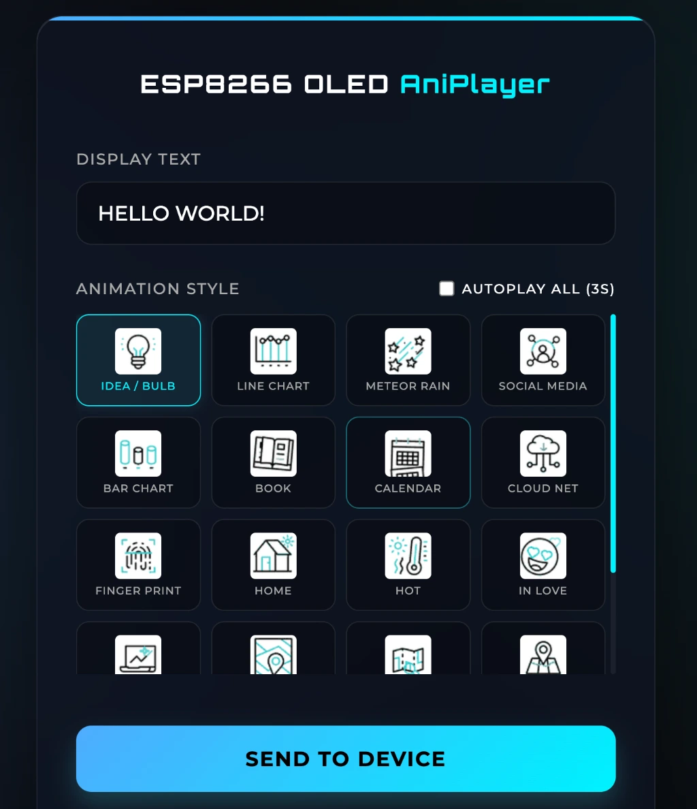
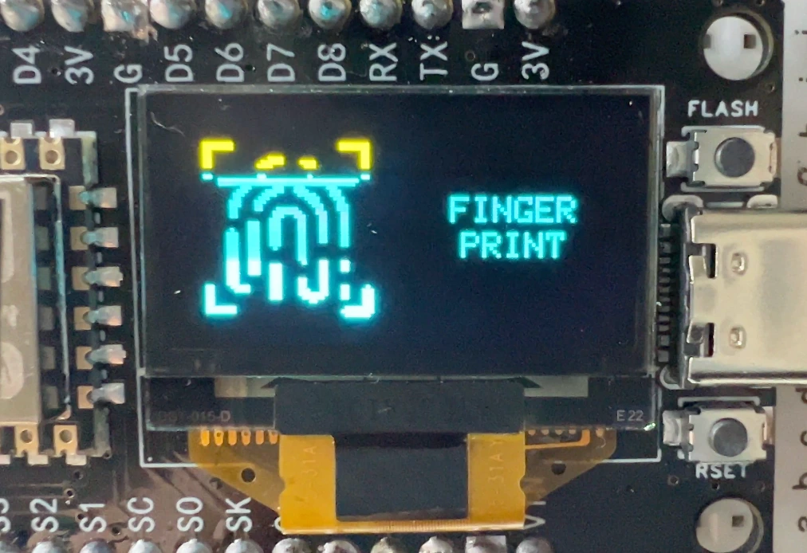
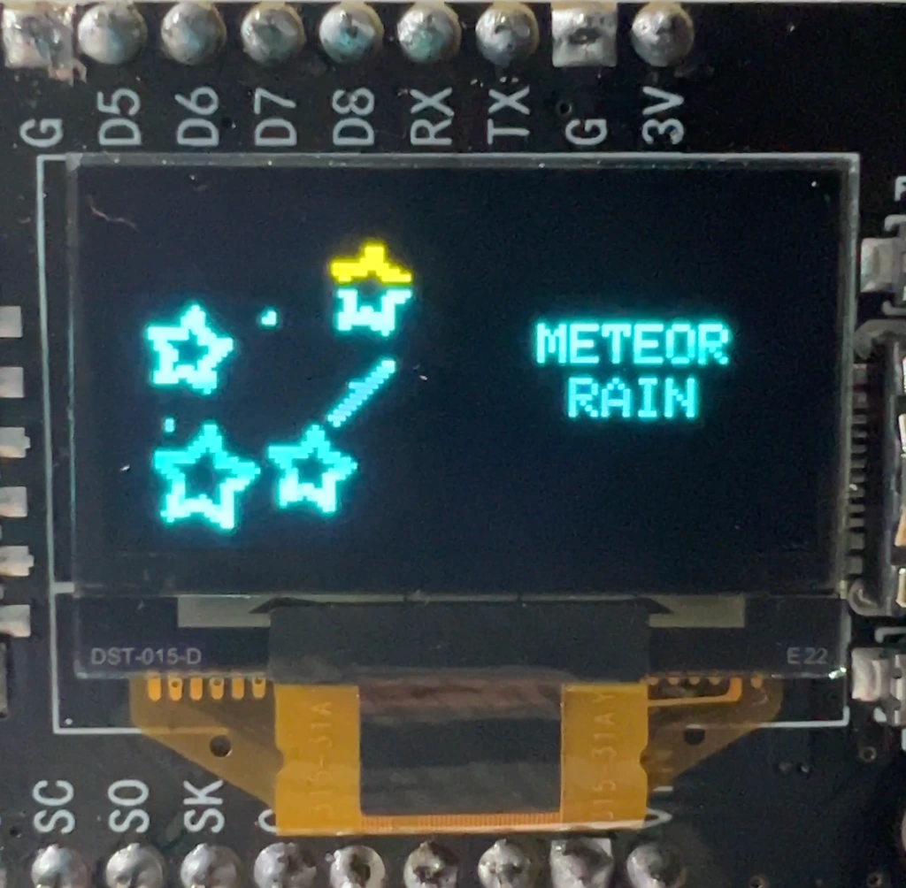

# ESP8266 OLED AniPlayer

ESP8266 와 128x64 OLED(SSD1306)를 사용한 텍스트 및 애니메이션 플레이어 프로젝트입니다.
내장된 총 20가지의 애니메이션과 커스텀 텍스트를 웹 브라우저를 통해 실시간으로 변경하고 제어할 수 있습니다.

## 스크린샷 (Screenshots)

### 웹 컨트롤 제어 화면 및 실제 출력 모습
| Web UI & Animation |
| :---: |
|  |
|  |
|  |

## 주요 기능 (Features)
- **128x64 I2C OLED 디스플레이 제어**
- 스마트폰 및 PC 브라우저에서 접속 가능한 내장 웹 서버 제공
- **20가지 다양한 애니메이션 내장** (IDEA, LINE CHART, METEOR RAIN, SOCIAL MEDIA 등)
- 자유로운 텍스트 입력 기능 지원 (우측 64x64 영역, 줄바꿈/정렬 자동 처리)
- 텍스트 미입력 시, 선택한 애니메이션 타이틀에 맞는 기본 문구 자동 지정
- **Autoplay All 모드**: 웹에서 해당 옵션 체크 후 업로드 시, 3초 간격으로 20개의 애니메이션과 텍스트가 순차적으로 자동 무한 재생
- 직관적이고 세련된 Glassmorphism 느낌의 웹 인터페이스 디자인 (Premium Design) 적용
- 기기 WiFi 연결 끊김 시, 5초 후 인식하여 자체 재부팅 및 자동 재연결

## 하드웨어 (Hardware Setup)
- **Board**: NodeMCU ESP8266 (ESP-12E Module)
- **Display**: SSD1306 0.96 인치 OLED (128x64 해상도, 0x3C I2C Address)

### 핀 맵 (Pin Mapping)
| ESP8266 (NodeMCU) | OLED (SSD1306) |
| :---: | :---: |
| 3.3V | VCC |
| GND | GND |
| D5 (GPIO 14) | SDA |
| D6 (GPIO 12) | SCL |

## 개발 환경 (Environment)
- **IDE**: VS Code (Visual Studio Code) + **PlatformIO** Extension
- **Framework**: Arduino ESP8266 (v3.2.0-dev)
- **Dependencies (Libraries)**:
  - Adafruit GFX Library (v1.12.4)
  - Adafruit SSD1306 (v2.5.16)

## 빌드 및 업로드 (How to Build & Upload)

1. **설정 설정**: `src/config.h` 파일 내에 접속할 공유기의 `WIFI_SSID` 와 `WIFI_PASSWORD` 정보를 기입합니다.
   ```cpp
   // src/config.h
   #define WIFI_SSID "YOUR_SSID"
   #define WIFI_PASSWORD "YOUR_PASSWORD"
   ```
2. 기기를 연결한 뒤, 터미널에서 아래의 **PlatformIO** 명령어로 펌웨어를 빌드 및 업로드 합니다.
   ```bash
   pio run --target upload
   ```
3. 업로드가 완료되면 시리얼 모니터(`baud rate: 74880`)를 열고 기기의 IP 주소를 확인합니다 (부팅이 완료되면 OLED 첫 화면에도 표시됩니다).
4. PC 혹은 스마트폰 브라우저에서 해당 `IP 주소` 또는 `http://billboard.local` 로 접속합니다.

## 개발용 유틸리티 파이썬 스크립트 (Scripts)
프로젝트 내부에 있는 파이썬 스크립트들은 썸네일과 애니메이션 자원(C 배열 헤더)을 쉽게 추가/수정하기 위해 제공됩니다.
- `convert_new_gifs.py`: `test_img/` 폴더 내에 위치한 새로운 `.gif` 파일 등을 읽어서 흑백 이진화, 노이즈 필터링 및 리사이징 처리를 진행한 뒤, C++ 비트맵 헤더 소스 `.h` 들을 자동으로 생성합니다. (Accent Colors 임계값 설정 포함)
- `generate_thumbnails.py`: `test_img/` 안의 이미지를 실제 웹(index.html 역할) UI 상에 표시할 수 있는 Base64 인코딩 스트링으로 변환합니다. 변환된 Base64 문자열은 `main.cpp` 에 곧바로 적용 가능합니다.
